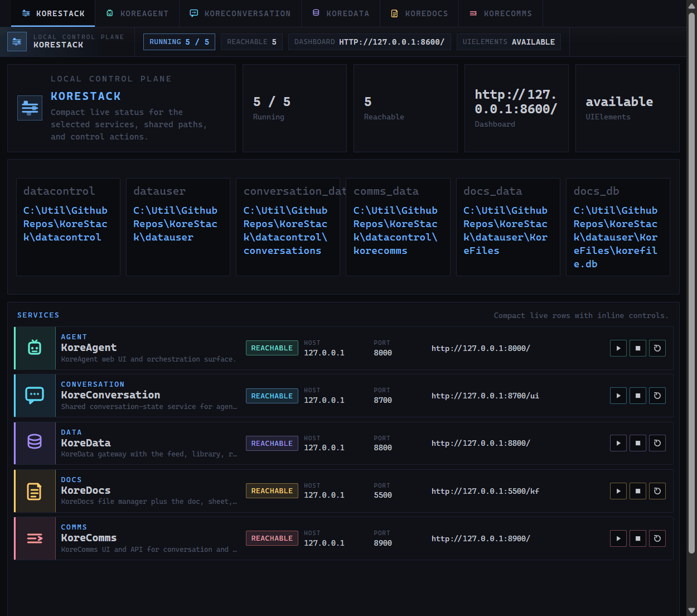

# KoreStack

KoreStack is now the consolidated local-first suite for the Kore system. Instead of a
set of separate repos that have to be started and understood independently, the suite is organized as one workspace with a single top-level entrypoint, a shared configuration layer, shared runtime data locations, and a coordinating control surface.



The consolidation goal is not to turn everything into one process. The goal is to make
the system operate as one product while keeping the service boundaries that are still
useful.

In the current shape of the suite:

- `KoreStack` is the control plane and landing page
- `KoreAgent` is the main agent runtime and orchestration surface
- `KoreChat` provides shared conversation-state services
- `KoreData` remains the data and knowledge service family
- `KoreDocs` remains the document and file service
- `KoreComms` remains the communications hub
- `UIElements` is the shared UI shell layer
- `config/` holds suite-level configuration
- `datacontrol/` and `datauser/` are suite-owned runtime data areas

## What KoreStack Is Now

KoreStack is the suite wrapper around the cooperating Kore services. It gives the system:

- one root startup path
- one landing page for starting, stopping, and checking services
- one shared suite layout and naming model
- one suite-level configuration location
- one suite-level runtime data layout

That means the repo should now be read as one application suite with multiple services,
not as a loose collection of related projects.

The naming contract used across the consolidated workspace is:

- `KoreX` names identify runnable suite services
- shared support layers that are not standalone services use non-`Kore` names

## Start The Suite

From the workspace root:

```powershell
python .\main.py
```

That starts the KoreStack landing page and launches the standard service set:

- KoreAgent on port 8605
- KoreConversation on port 8630
- KoreData on port 8620
- KoreDocs on port 8615
- KoreComms on port 8625
- KoreStack on port 8600

Open the suite landing page at:

```text
http://127.0.0.1:8600/
```

## Operate The Suite

KoreStack is the parent process for the local system. To stop the full suite cleanly,
press `Ctrl+C` in the terminal where you started it.

If you want to manage individual services while the suite stays up, use the controls on
the KoreStack landing page. Service cards can be stopped, started, and restarted without
tearing down the whole suite.

## Workspace Layout

The top-level layout now reflects the consolidated suite contract:

- `KoreStack/` - suite coordination and landing page
- `KoreAgent/` - agent runtime and orchestration
- `KoreChat/` - conversation-state service
- `KoreData/` - data and knowledge services
- `KoreDocs/` - document and file services
- `KoreComms/` - communications services
- `UIElements/` - shared UI assets and shell conventions
- `config/` - shared suite configuration
- `datacontrol/` - operational state, logs, schedules, queues, and test output
- `datauser/` - user-owned working files and content

The important shift is that `config/`, `datacontrol/`, and `datauser/` are now suite
assets at the workspace root rather than being treated as belonging to just one service.

`config/default.json` now matches the current suite port map. `config/local.json` remains an optional machine-local overlay rather than the place where the active defaults live.

## Common Commands

Run only part of the suite:

```powershell
python .\main.py --services agent,conversation,docs
```

Check service availability without starting anything:

```powershell
python .\main.py status
```

Show the resolved startup plan:

```powershell
python .\main.py --dry-run
```