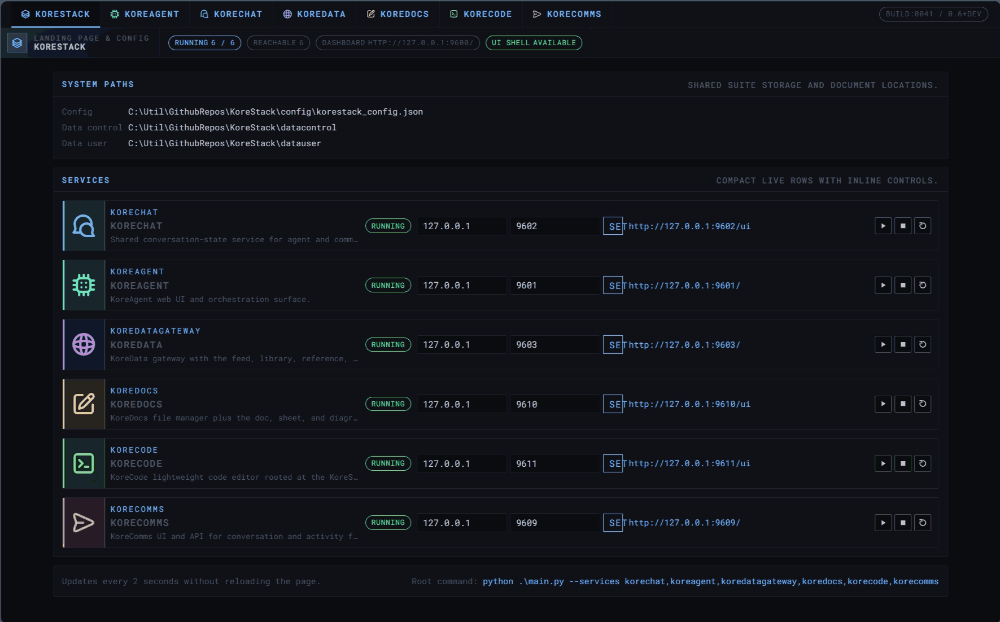

# KoreStack

KoreStack is a local-first AI workspace made up of cooperating Python services: an agent runtime, a conversation store, a document suite, a code editor, a data gateway, a communications hub, and a suite dashboard that starts and monitors them together.



This repository should be readable from the top down. The root README is the GitHub entry point. Each major subsystem now has its own README for purpose, setup, and troubleshooting. Detailed design documents still exist where they add engineering value, but product-overview and setup guidance is now meant to live in these primary READMEs.

## What is in the suite

| Subsystem | Role | README |
|---|---|---|
| `KoreStack/` | Launches services, shows health, and acts as the suite dashboard | [KoreStack/README.md](KoreStack/README.md) |
| `KoreAgent/` | Local agent runtime, tool orchestration, scheduling, and session workflows | [KoreAgent/README.md](KoreAgent/README.md) |
| `KoreChat/` | Canonical conversation, message, and event store used by the agent and comms layers | [KoreChat/README.md](KoreChat/README.md) |
| `KoreData/` | Unified data gateway over feeds, library, reference, graph, and RAG services | [KoreData/README.md](KoreData/README.md) |
| `KoreDocs/` | Browser-based document, spreadsheet, and diagram tools plus MCP endpoints | [KoreDocs/README.md](KoreDocs/README.md) |
| `KoreCode/` | Browser-based workspace code editor and AI-assisted coding surface | [KoreCode/README.md](KoreCode/README.md) |
| `KoreComms/` | External-channel bridge for Discord, Gmail, manual messages, and agent replies | [KoreComms/README.md](KoreComms/README.md) |
| `KoreLiveWeb/` | Isolated web-search, fetch, navigation, research, and Wikipedia MCP service | [KoreLiveWeb/README.md](KoreLiveWeb/README.md) |

## Shared support components

| Folder | Why it exists |
|---|---|
| `KoreCommon/` | Shared path, config, logging, and service helpers used across the suite. See [KoreCommon/README.md](KoreCommon/README.md). |
| `KoreUI/` | Service-specific UI templates and static frontend assets consumed by the browser apps. See [KoreUI/README.md](KoreUI/README.md). |
| `KoreUI/UIElements/` | Shared UI shell, tokens, chrome, and assets used by the browser apps. See [UIElements README](KoreUI/UIElements/README.md). |
| `config/` | Checked-in suite configuration, including service ports and LLM bootstrap settings. See [config/README.md](config/README.md). |

## Quick start

### Prerequisites

- Python 3.11 or newer
- A writable data root referenced by `config/korestack_config.json`
- For `KoreAgent`, either Ollama or another configured LLM endpoint reachable from `config/koreagent_config.json`

### Install

```powershell
python -m venv .venv
.venv\Scripts\Activate.ps1
pip install -r requirements.txt
```

### Review configuration before first run

Check these files first:

- `config/korestack_config.json` for ports, host binding, data-root paths, and MCP service wiring
- `config/koreagent_config.json` for the agent model host and default model configuration

The checked-in config currently uses `paths.dataroot` as the backing location for `Data/datacontrol/` and `Data/datauser/`. If that path does not exist on your machine, update it before starting the suite.

### Start the suite

```powershell
python .\main.py
```

That command delegates to `KoreStack/main.py`, which launches the enabled child services and the suite dashboard.

Open the dashboard at the configured KoreStack URL. In the checked-in config this is:

```text
http://127.0.0.1:19600/
```

### Useful startup variants

```powershell
python .\main.py --dry-run
python .\main.py status
python .\main.py --services koreagent,korechat,koredocs
python .\main.py --services korecode --no-dashboard
```

## New user map

If you are new to the repo, start in this order:

1. Read this file for the suite overview.
2. Read [KoreStack/README.md](KoreStack/README.md) to understand how the services are launched.
3. Read the README for the subsystem you want to work on first.
4. Treat other markdown files as exceptional rather than normal; if a workflow matters, it should be described from a README.

## Architecture principles

The suite is intentionally a set of cooperating local services rather than one monolith.

- `KoreStack` is the operator-facing control plane and launcher
- `KoreAgent` owns orchestration and tool use, not durable conversation storage
- `KoreChat` owns canonical conversations and event history
- `KoreComms` owns external-channel integration, not core agent state
- `KoreData` and `KoreDocs` stay as domain services instead of becoming internal agent libraries
- `KoreUI/UIElements` provides the shared browser shell alongside KoreUI's service-specific frontend assets

## Shared service contract

The suite is converging on one common HTTP shape for browser-facing services:

- `/` redirects or lands on the main browser entry
- `/ui` is the stable browser shell entry where the service uses that pattern
- `/api/...` is the JSON or action API surface
- `/status` is the health probe used by KoreStack
- `/mcp` is the MCP transport entry point where the service exposes tools

Browser apps should use the shared `KoreUI/UIElements` shell and suite URL wiring rather than inventing service-local chrome patterns.

## Near-term direction

- The agent runtime is moving toward tighter planning, validation, and work-item control rather than looser chat-driven tool loops
- Long-running research is intended to become a first-class managed workflow layered above bounded agent runs, rather than staying as ad hoc conversation state
- New data sources should normally land inside existing subsystem boundaries instead of creating one-off services

## Data layout

KoreStack separates service-owned runtime state from user-owned content.

| Location | Purpose |
|---|---|
| `Data/datacontrol/` | Structured service data such as SQLite databases, schedules, logs, and runtime state |
| `Data/datauser/` | User-facing files such as notes, sheets, documents, diagrams, exports, and working files |

In practice, the actual data root is resolved from `paths.dataroot` or the `KORE_SUITE_DATAROOT` environment variable. The `Data/` folder in the repo is useful as a reference layout, but your live data may be located elsewhere.

## Troubleshooting

| Problem | What to check |
|---|---|
| `python .\main.py` fails immediately | Activate the virtual environment and rerun `pip install -r requirements.txt` |
| Services fail to start or exit on boot | Run `python .\main.py --dry-run` and confirm the configured ports and service enablement flags |
| Errors mention missing folders or databases | Verify `paths.dataroot` in `config/korestack_config.json` points to a valid writable location |
| KoreAgent starts but model calls fail | Check `config/koreagent_config.json`, confirm the LLM host is reachable, and make sure the selected model exists |
| Browser UI loads without styling | Confirm `KoreUI/UIElements/` is present and that the app can serve shared assets from `/ui-elements/assets/` |
| A single service is blocking the whole suite | Start a narrower set with `--services ...` and debug that subsystem in isolation |

## Documentation rule

Primary operator and developer orientation should now live in the root and subsystem READMEs. One-off planning notes, scratch docs, generated inventories, and superseded setup guides should be treated as cleanup candidates rather than long-lived documentation.
