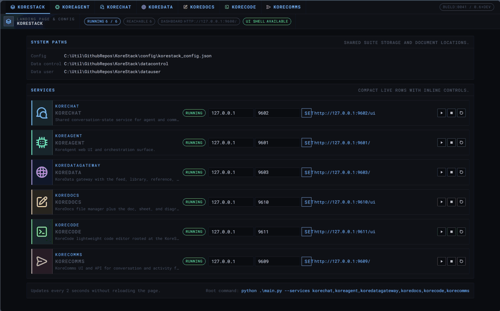

# KoreStack

KoreStack is a local-first AI workspace built from cooperating Python services: an agent runtime, a conversation store, a data layer, document and code editors, an external communications hub, visual agent networks, scheduling, and two test subsystems. It is started, supervised, and used as **one system**; you never launch a subsystem on its own.



## Quick start

Requirements: Python 3.11+, a writable data root, and an Ollama host (or other configured LLM endpoint).

```powershell
python -m venv .venv
.venv\Scripts\Activate.ps1
pip install -r requirements.txt
python .\main.py
```

Then open the landing page at `http://127.0.0.1:29600/`. It lists every service with its health, and links to each subsystem UI.

Before the first run review `config/korestack_config.json` (ports, `paths.dataroot`) and `config/koreagent_config.json` (LLM host and models). See [config/README.md](config/README.md).

## Command line

This is the only place the suite's command line is documented. The root `main.py` runs `KoreStack/main.py`.

| Command | Effect |
|---|---|
| `python .\main.py` | Start every enabled service plus the landing page (same as `start`) |
| `python .\main.py status` | Report the health of the running services |
| `python .\main.py --dry-run` | Print the resolved start plan without launching anything |
| `python .\main.py --services a,b` | Start only the named services (`all` by default) |
| `python .\main.py --host H --ui-port P` | Override the bind host and landing-page port |
| `python .\main.py --open-browser` | Open the landing page once started |

Valid service names: `korechat`, `koreagent`, `koredatagateway`, `koredocs`, `korecode`, `korecomms`, `koreliveweb`, `korecron`, `koretest2`, `koreunittest`, `koreagentnetwork`.

## The subsystems

| Subsystem | Port | What it does | How it contributes |
|---|---|---|---|
| [KoreStack](KoreStack/README.md) | 29600 | Supervisor and landing page | Starts, probes, and links every other service; shows Ollama state |
| [KoreAgent](KoreAgent/README.md) | 29601 | Agent runtime: sessions, tool loop, skills, slash commands, System One | The brain; every other service that needs an LLM calls its API |
| [KoreChat](KoreChat/README.md) | 29602 | Canonical conversation, message, and event store | Shared thread record for the agent and the comms layer |
| [KoreData](KoreData/README.md) | 29603 + children | Gateway over feed, library, RAG, reference, graph, and scrape services | One search and retrieval surface for agents and browsers |
| [KoreDocs](KoreDocs/README.md) | 29610 | Documents, spreadsheets, and diagrams on the user filesystem | Agent-editable user content, via UI and MCP |
| [KoreCode](KoreCode/README.md) | 29611 | Browser code workspace with indexing and AI edit flows | Coding surface scoped to the repository |
| [KoreComms](KoreComms/README.md) | 29609 | Discord, Gmail, SFTP, and manual message bridges | Isolates external channels from the agent |
| [KoreLiveWeb](KoreLiveWeb/README.md) | 29613 | Web search, fetch, navigation, and Wikipedia MCP tools | Live web evidence, kept apart from local data |
| [KoreCron](KoreCron/README.md) | 29615 | Scheduled prompts and scheduled test runs | Time-based driver for KoreAgent and KoreTest2 |
| [KoreTest2](KoreTest2/README.md) | 29616 | System tests: prompts and commands run against the live interfaces | Per-build regression of the whole stack |
| [KoreUnitTest](KoreUnitTest/README.md) | 29618 | Python unit tests, one file per test | Per-build regression of internal code |
| [KoreAgentNetwork](KoreAgentNetwork/README.md) | 29617 | Visual, executable networks of Python, LLM, and Decision blocks | Composable automation that calls other services |

Shared support:

| Folder | Role |
|---|---|
| [KoreCommon/](KoreCommon/README.md) | Path, config, logging, and service helpers imported by every service |
| [KoreUI/](KoreUI/README.md) | Service-specific templates and static assets; [UIElements](KoreUI/UIElements/README.md) is the shared shell and top bar |
| [config/](config/README.md) | Checked-in suite configuration |

## Architecture

```text
                     KoreStack (29600) supervisor + landing page
                                   | starts / probes /status
   +-----------+-----------+-------+-------+-----------+------------+
 KoreChat   KoreAgent    KoreData     KoreDocs/Code   KoreComms   KoreLiveWeb
 threads    LLM + tools  gateway      user content    channels    web tools
     ^         ^   ^         ^
     |         |   +---------+---- MCP tools, skills
     |         |
 KoreCron -> KoreAgent prompts      KoreAgentNetwork -> /api/work-packet
 KoreCron -> KoreTest2 sessions     KoreTest2 judge  -> /api/work-packet
                                    KoreUnitTest     -> runs repo test files
```

- **Control plane**: KoreStack resolves config, launches services, and polls each `/status`.
- **Agent runtime**: KoreAgent owns orchestration and tools. KoreChat owns durable conversation state. KoreComms owns external channels.
- **Data services**: KoreData and KoreDocs stay domain services that the agent reaches through MCP and HTTP, never internal libraries.
- **LLM models**: a chat model plus an Ollama System One decision model (typed questions scored with probabilities). KoreAgent's `/api/work-packet` exposes both to the rest of the suite.
- **Automation and testing**: KoreCron drives time-based work; KoreAgentNetwork builds visual pipelines; KoreTest2 and KoreUnitTest verify each new build.

### Shared service contract

- `/` or `/ui`: browser shell
- `/api/...`: JSON API
- `/status`: health probe used by KoreStack
- `/mcp`: MCP tools, where a service exposes them

Browser pages share the `KoreUI/UIElements` shell and top bar, which links all suite UIs.

## Data layout

| Location | Purpose |
|---|---|
| `<dataroot>/datacontrol/` | Service-owned state: databases, schedules, logs, test cases and results |
| `<dataroot>/datauser/` | User content: documents, sheets, diagrams, files that networks and agents read and write |

`<dataroot>` is `paths.dataroot` in `config/korestack_config.json`, overridden by `KORE_SUITE_DATAROOT`. The repo `Data/` folder is a reference layout only.

## Troubleshooting

| Problem | What to check |
|---|---|
| Start fails immediately | Activate the venv and rerun `pip install -r requirements.txt` |
| A service is red on the landing page | `python .\main.py --dry-run` for ports and enablement, then that service's log in `<dataroot>/datacontrol/logs` |
| Missing folders or databases | `paths.dataroot` must point to a writable location |
| Model calls fail | Check `config/koreagent_config.json` and that the Ollama host and models exist |
| Unstyled pages | `KoreUI/UIElements/` must be present |
| One service blocks the rest | Start fewer with `--services ...` |

## Documentation rule

Primary documentation lives in the root and subsystem READMEs. [ChangeLog.md](ChangeLog.md) records dated changes.
